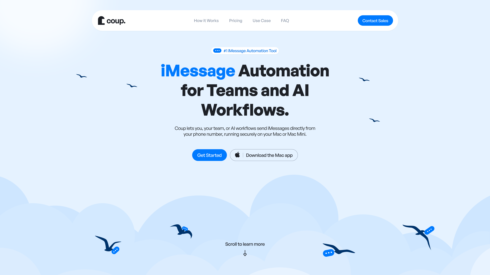
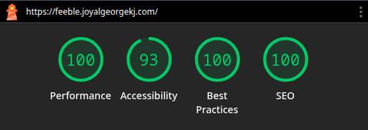

# Frontend Developer Assignment – Hero Section

---

## Tech Stack

- **React + TypeScript**
- **Tailwind CSS (v4)**
- **Vite**
- **Hosted on Vercel (subdomain)**

---

## What’s Implemented

- Pixel-accurate layout, spacing, typography, and colors
- All animations and interactions from the Figma prototype
- Responsive behavior with desktop parity preserved
- Optimized font loading and asset handling
- Modular, readable, and maintainable component structure
- Decorative animations respect `prefers-reduced-motion`

---

## Key Decisions & Assumptions

- Animations use **CSS transforms** and appropriate easing for smooth motion
- On smaller screens:
  - Navigation collapses into a hamburger menu
  - Primary CTA remains visible
- Fonts are self-hosted with `font-display: swap` to avoid render blocking
- One contrast warning remains due to strict adherence to brand colors (intentional)

---

## Performance



- Metrics measured on **production build** (`vite build + preview`)
- Performance, accessibility, and best-practice optimizations applied

---

## Live Demo

🔗 **Deployed URL**  
https://feeble.joyalgeorgekj.com

---

## Folder Structure

```bash
/
├── design          // Design references
├── public          // Public assets (fonts, favicons, etc.)
│   └── fonts
└── src
    ├── assets      // Images, SVGs, CSS
    │   ├── css
    │   └── svg
    ├── components  // Split, reusable components
    ├── constants   // Centralized configuration/data
    └── helper      // Utility functions
````

---

## Notes

Focuses on **execution quality over over-engineering**, reflecting a real-world frontend approach: precise visuals, intentional motion, and long-term maintainability.